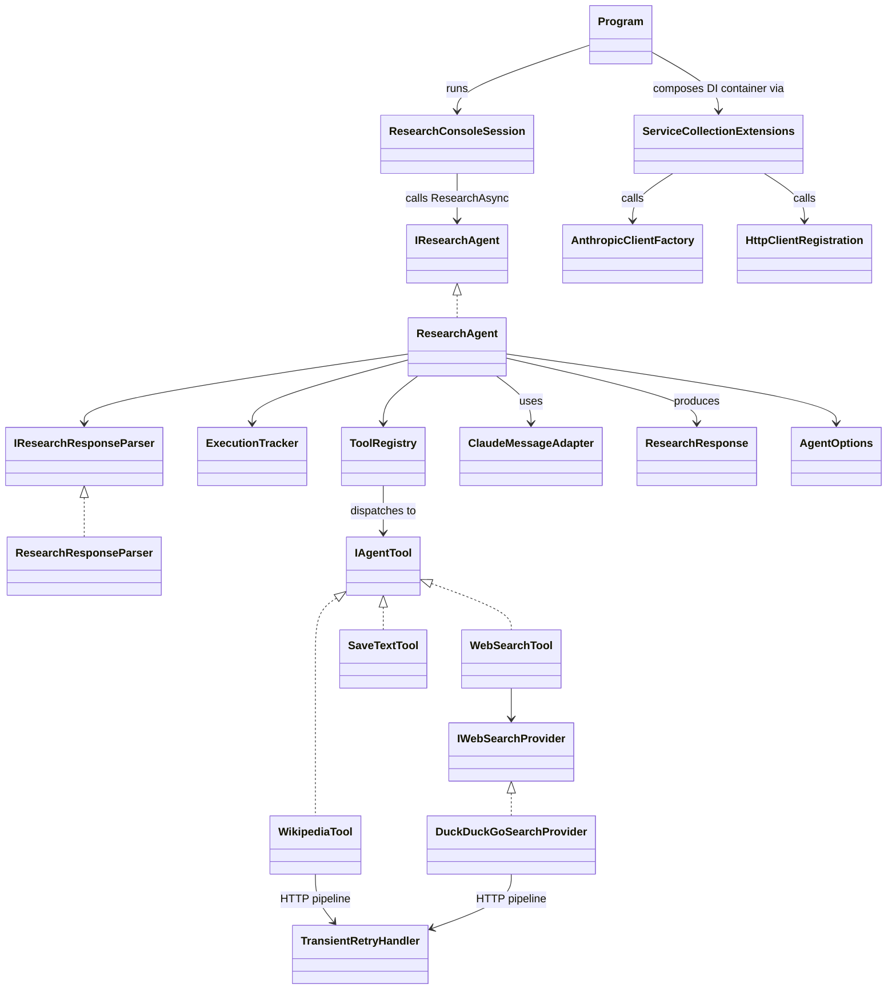
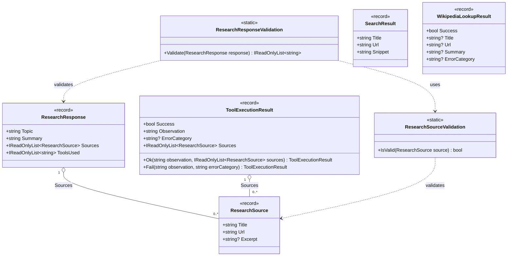
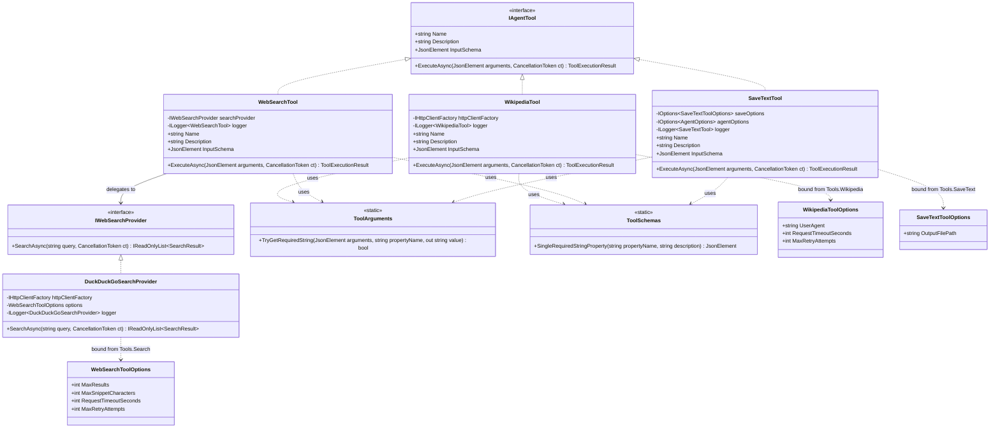
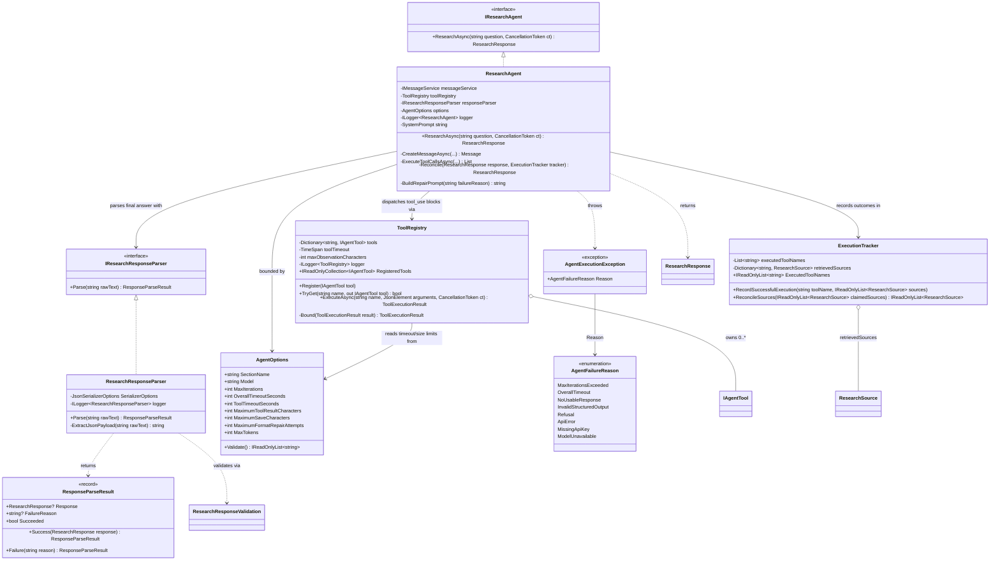
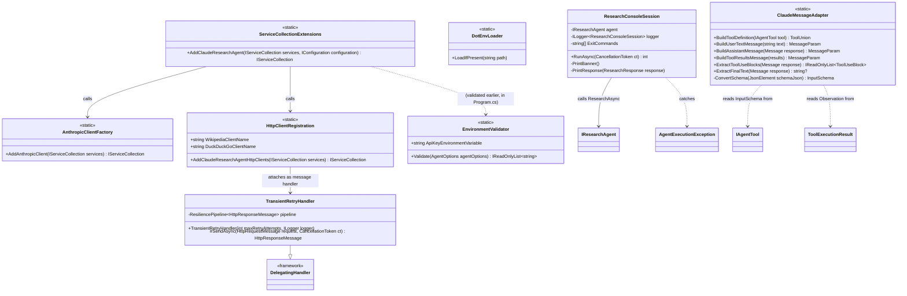

# Claude Research Agent — Class Diagrams

Companion to [README.md](README.md), which covers the runtime architecture, sequence flow, and
retry behavior. This document covers static structure: the actual classes, interfaces, and
relationships in `src/ClaudeResearchAgent/`.

Diagrams are split by layer/namespace so each one stays legible — start with
[System Overview](#0-system-overview) for how they fit together, then drill into the layer you
care about.

> **Reading notes:** async methods are shown with their unwrapped result type (the `Task<...>` /
> `Task` wrapper is dropped for readability). `<<static>>` marks a static utility class; `<<record>>`
> marks a C# `record`. Interface realization is drawn `Interface <|.. Implementation`.

## Contents

- [0. System overview](#0-system-overview)
- [1. Domain models (`Models`)](#1-domain-models-models)
- [2. Tools and search (`Tools`, `Search`)](#2-tools-and-search-tools-search)
- [3. Agent orchestration (`Agent`)](#3-agent-orchestration-agent)
- [4. Infrastructure, configuration, and console (`Infrastructure`, `Configuration`, `ConsoleUi`)](#4-infrastructure-configuration-and-console-infrastructure-configuration-consoleui)

## 0. System overview

High-level relationships only — no members. See the sections below for full class detail, and the
README's [architecture diagram](README.md#architecture-overview) for how this maps onto runtime
data flow.

## 1. Domain models (`Models`)

Framework-agnostic records that carry data between every other layer. Nothing here references the
Anthropic SDK or `System.Net.Http` — see [ADR note in README](README.md#architecture-overview) on
why that boundary is kept clean.

*(`WikipediaLookupResult` is serialized to JSON as a `WikipediaTool` observation — it does not
compose with the other models directly; see [section 2](#2-tools-and-search-tools-search).)*

## 2. Tools and search (`Tools`, `Search`)

The three agent-callable capabilities, all implementing `IAgentTool`, plus the `search` tool's
provider abstraction.

## 3. Agent orchestration (`Agent`)

The explicit tool-calling loop and everything it depends on: dispatch, structured-output parsing,
and the application-recorded state that keeps Claude's final answer honest.

## 4. Infrastructure, configuration, and console (`Infrastructure`, `Configuration`, `ConsoleUi`)

The provider-specific boundary (`Infrastructure` is the only layer besides `Agent` allowed to
reference Anthropic SDK types — see [README](README.md#architecture-overview)), plus startup
validation and the REPL loop.

---

For how these classes actually get exercised at runtime — the iteration loop, retry timing, and
what gets sent back to Claude on each turn — see the [sequence](README.md#the-agent-loop) and
[retry](README.md#tool-failure-and-retry-behavior) diagrams in the README.
