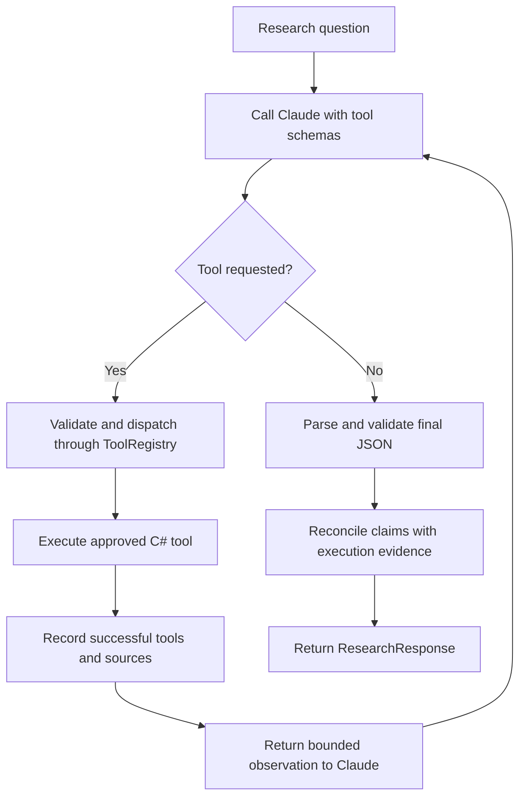
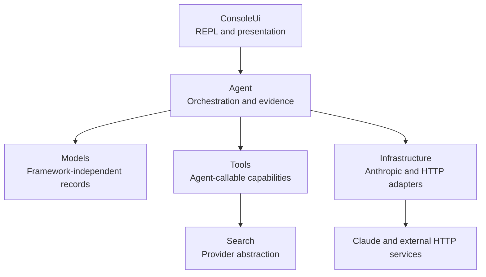
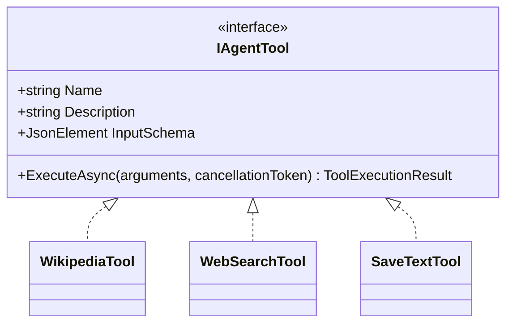
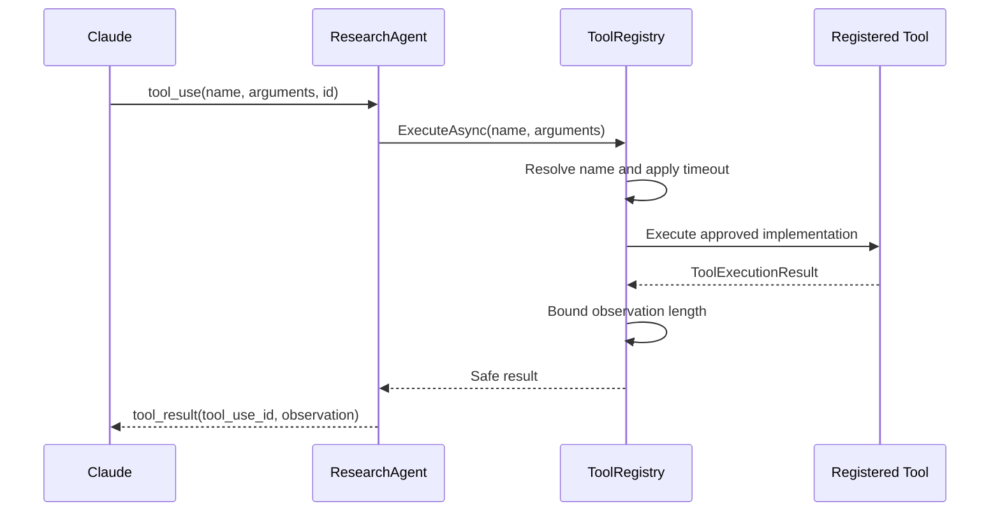
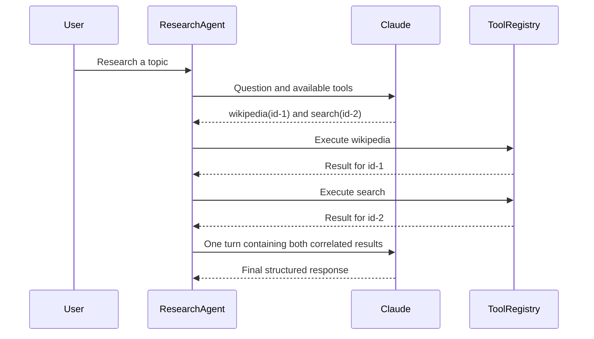
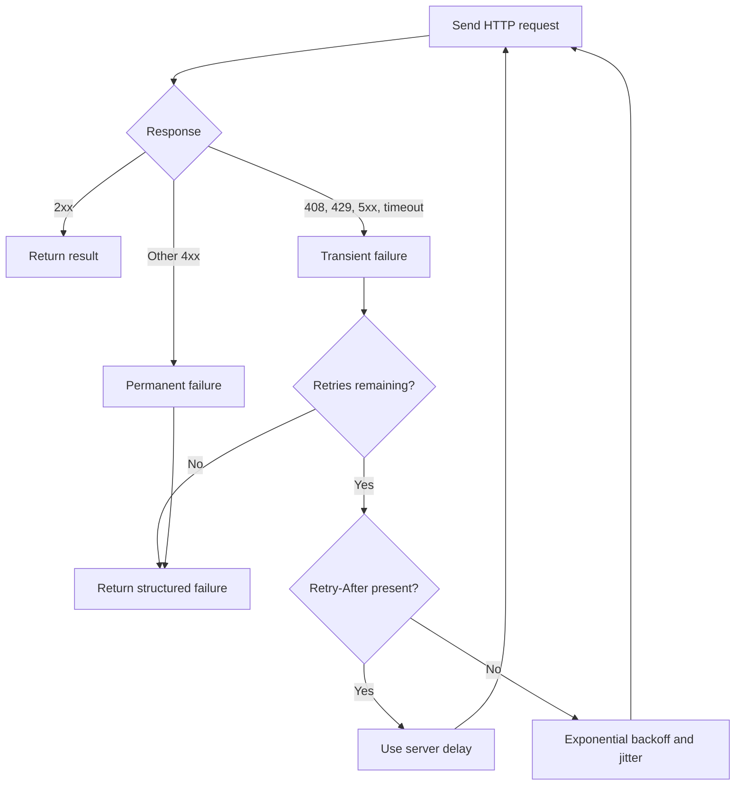
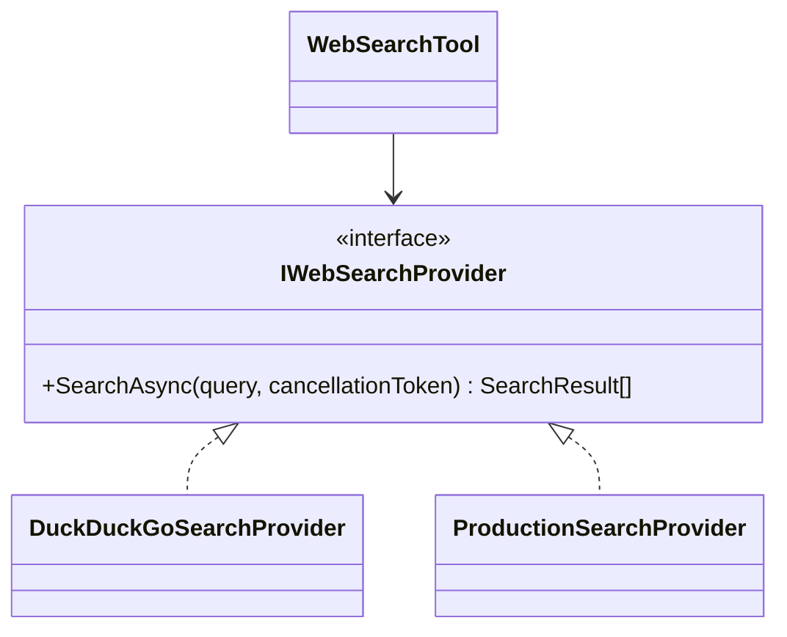
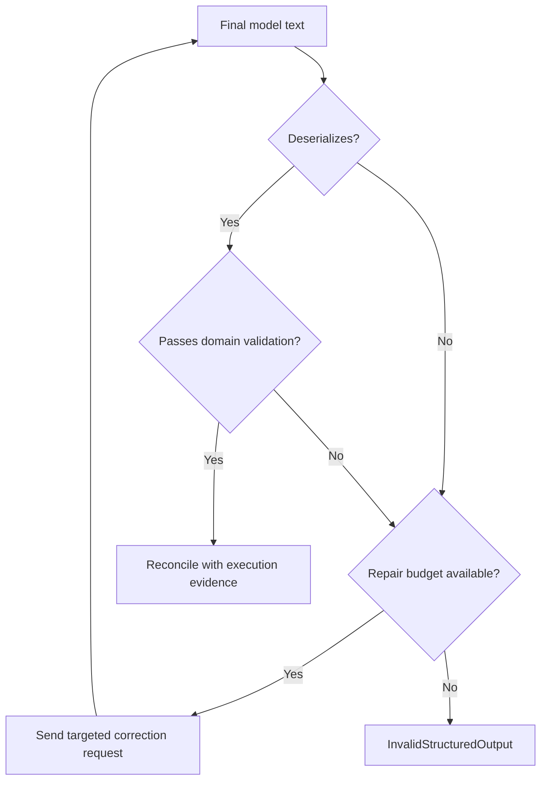
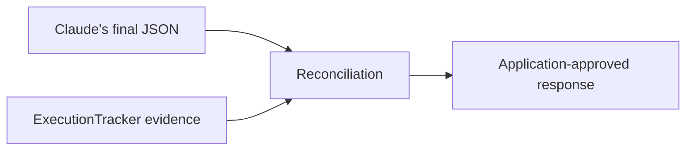
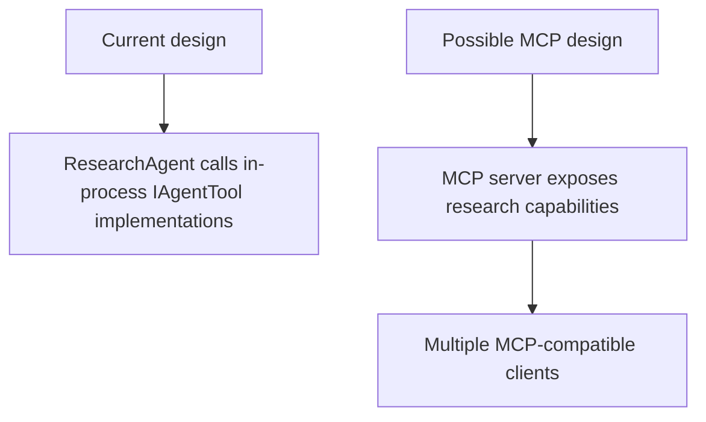

# Inside a C# AI Research Agent: Claude Tool Calling, Explicit Orchestration, and Validated Structured Output

Large language models can answer questions, but an **AI agent** does something more interesting: it can decide that it needs outside information, request an appropriate tool, observe the result, and continue until it has enough evidence to produce an answer.

That description sounds simple. The engineering is not.

A dependable agent must answer several difficult questions:

- Who decides which tools are available?
- Who actually executes a requested action?
- How are tool calls correlated with their results?
- What prevents an infinite model/tool loop?
- What happens when Wikipedia, search, or the model API fails?
- How do we stop a model from inventing sources it never retrieved?
- How do we turn probabilistic model text into a strongly typed C# result?
- How can the complete workflow be tested without making live, paid API calls?

This article explores those questions through a working [.NET 8 Claude Research Agent](https://github.com/MindProber07/CsClaudeResearchAgent). It is a console application built around an explicit multi-turn tool-calling loop, three registered tools, structured output validation, evidence reconciliation, dependency injection, resilient HTTP integrations, and a fully offline xUnit test suite.

The most important architectural principle is this:

> **Claude supplies reasoning and proposes actions. The C# application owns execution, boundaries, evidence, and validation.**

That distinction turns a clever model demonstration into an understandable and governable software system.

## What the research agent does

The user enters a research question at the console. The application sends the question, system instructions, conversation history, and available tool definitions to Claude.

Claude can either:

1. Return one or more tool requests.
2. Return a final response when it believes the research is complete.

The application currently exposes three capabilities:

| Tool | Purpose | Side effect |
|---|---|---|
| `wikipedia` | Find a Wikipedia page and retrieve its summary and canonical URL | Network read |
| `search` | Retrieve web-oriented results through an abstract search provider | Network read |
| `save_text_to_file` | Append model-supplied content to one configured file | Local write |

Claude never calls Wikipedia, DuckDuckGo, or the file system directly. It emits a structured request. The application verifies the tool name, enforces execution limits, invokes the registered C# implementation, bounds the observation, and returns a correlated tool result to Claude.

The cycle repeats until Claude stops requesting tools and produces a final JSON document.



This is not autonomous execution in the unrestricted sense. It is **bounded autonomy inside an application-controlled runtime**.

## Why explicit orchestration matters

Agent frameworks can reduce boilerplate, but they can also hide the exact conversation protocol. This project implements the orchestration loop directly in `ResearchAgent`.

That makes several behaviors visible and testable:

- The complete assistant turn is retained between model calls.
- Tool-use blocks are discovered by content type rather than assumed position.
- Multiple tool requests in one assistant turn are all handled.
- Every result carries the exact `tool_use_id` it answers.
- Tool observations return to Claude in one user message.
- Iterations and wall-clock execution are bounded.
- Malformed final output has a separate, bounded repair budget.
- Failure exits through typed application exceptions.

An explicit loop also forces us to recognize that an agent has two interacting state machines:

1. **Research state** — model calls, tool requests, and tool observations.
2. **Output state** — final JSON parsing, validation, optional repair, and reconciliation.

Mixing those concerns into an unbounded `while` loop would make failure behavior difficult to reason about. Keeping them explicit gives the host application control.

## Architecture: separate the model from the application

The solution divides responsibilities into focused layers.



### Console UI

`ResearchConsoleSession` owns the read/run/print loop. It displays the prompt, recognizes `exit` and `quit`, passes the question to `IResearchAgent`, prints a clean result, and maps known execution failures to user-facing messages.

It does not know how Claude content blocks work and does not dispatch tools. That is important: presentation should not become orchestration.

### Agent layer

The agent layer contains the application’s control plane:

- `IResearchAgent` defines the research operation.
- `ResearchAgent` owns the model/tool loop.
- `ToolRegistry` is the single tool dispatch boundary.
- `ExecutionTracker` records what actually happened.
- `IResearchResponseParser` abstracts final-response parsing.
- `ResearchResponseParser` deserializes and validates output.
- `AgentExecutionException` and `AgentFailureReason` provide typed failures.

### Infrastructure

Infrastructure contains provider-specific and transport-specific integration:

- `ClaudeMessageAdapter` translates between application objects and Anthropic SDK content blocks.
- `AnthropicClientFactory` registers the model client.
- `HttpClientRegistration` configures named clients.
- `TransientRetryHandler` applies HTTP retry behavior.

Provider-specific wire types are therefore contained rather than spread through every layer.

### Tools and search

Every model-callable capability implements `IAgentTool`. The web-search tool depends on `IWebSearchProvider`, not directly on DuckDuckGo, so the provider can be replaced without changing the tool name or agent loop.

### Domain models

The central domain records remain framework-independent:

- `ResearchResponse`
- `ResearchSource`
- `SearchResult`
- `ToolExecutionResult`
- `WikipediaLookupResult`

The console can consume `ResearchResponse` without knowing anything about Anthropic messages, HTTP clients, or JSON content blocks.

## The tool contract

An agent tool needs more than an `Execute` method. Claude must know its name, what it does, and which arguments are valid.

Conceptually, the interface looks like this:

```csharp
public interface IAgentTool
{
    string Name { get; }
    string Description { get; }
    JsonElement InputSchema { get; }

    Task<ToolExecutionResult> ExecuteAsync(
        JsonElement arguments,
        CancellationToken cancellationToken);
}
```

This creates one consistent contract for very different capabilities.



`ToolSchemas` builds the JSON schema shown to Claude, while `ToolArguments` performs application-side argument extraction. The schema helps the model formulate a valid request; application-side validation remains necessary because model output is not trusted merely because a schema was supplied.

This is a recurring rule in LLM engineering:

> **A prompt or schema guides model behavior. Application code enforces policy.**

## ToolRegistry: the execution boundary

`ToolRegistry` is more than a dictionary of functions. It is the enforcement point between a model-generated request and real execution.

Its responsibilities include:

- Registering or indexing approved tools by name.
- Rejecting unknown names safely.
- Applying a per-tool timeout.
- Catching unexpected tool exceptions.
- Converting failure into a safe `ToolExecutionResult`.
- Truncating observations before returning them to the conversation.



If Claude requests a nonexistent tool, the registry returns a structured `unknown_tool` failure. It does not use reflection to discover an arbitrary method, construct an operating-system command, or let the model choose an implementation path.

This is the practical security model of tool calling: **allow-list capabilities and constrain their arguments**.

## Walking through the agent loop

The runtime sequence begins when the console calls:

```csharp
ResearchResponse response = await researchAgent.ResearchAsync(
    question,
    cancellationToken);
```

Inside `ResearchAgent`, a new conversation and an execution tracker are created for the research request. The initial user question is sent to Claude together with the registered tool definitions.

### Step 1: inspect every response block

A Claude response can contain different content-block types. Text is not guaranteed to be the first block, particularly when extended-thinking features are involved.

`ClaudeMessageAdapter` therefore scans by type:

- `ExtractToolUseBlocks` locates every tool request.
- `ExtractFinalText` locates a usable text block.
- `BuildAssistantMessage` preserves the assistant response for the next turn.
- `BuildToolResultsMessage` creates correctly correlated tool results.

This avoids a fragile implementation such as:

```csharp
// Fragile: assumes the first block is always final text.
var text = response.Content[0];
```

Content blocks must be interpreted by their discriminator, not their array position.

### Step 2: preserve the assistant turn

When Claude requests a tool, the complete assistant turn is appended to the conversation. That includes tool-use blocks and any thinking or redacted-thinking blocks required by the provider protocol.

The application preserves those blocks in the wire conversation but does not display internal reasoning in console output or application logs.

### Step 3: execute all requested tools

Claude may request more than one tool in a response. Each request is dispatched through `ToolRegistry`. The application retains the tool-use identifier so the corresponding observation can be sent back correctly.

Conceptually:

```csharp
foreach (var toolCall in toolCalls)
{
    ToolExecutionResult result = await toolRegistry.ExecuteAsync(
        toolCall.Name,
        toolCall.Arguments,
        cancellationToken);

    results.Add((toolCall.Id, result));
}
```

The real value is not the loop syntax. It is the protocol guarantee: every tool result answers the correct tool request.

### Step 4: treat results as observations

Tool output is added to the conversation as data for Claude to interpret. It is not silently promoted to application truth.

This matters because external content can be incomplete, incorrect, or malicious. Search snippets and retrieved pages may even contain prompt-injection instructions. Calling them “untrusted observations” in the system instructions helps, but the real defense is that host-side permissions and limits remain in force regardless of what the content says.

### Step 5: continue within bounded budgets

The loop is constrained by several independent controls:

| Control | Scope |
|---|---|
| `MaxIterations` | Maximum Claude round trips |
| `OverallTimeoutSeconds` | Wall-clock budget for the full research run |
| `ToolTimeoutSeconds` | Maximum duration of one tool execution |
| `MaximumToolResultCharacters` | Maximum observation size returned to Claude |
| `MaximumFormatRepairAttempts` | Maximum structured-output repair calls |
| `MaxTokens` | Maximum model output budget per call |

No single limit substitutes for all the others. A tool timeout does not prevent an endless sequence of short calls, while an iteration cap does not stop one network request from hanging indefinitely. Layered budgets create predictable resource consumption.

## Multiple tool calls in one turn

Supporting several tool requests is an important protocol detail.



The current sequential approach is deterministic and easy to reason about. Independent read-only tools could later be executed concurrently, but that would require deliberate decisions about ordering, rate limits, shared tracking, cancellation, and side-effecting tools.

Parallelism should be introduced as an explicit policy—not as an accidental consequence of calling `Task.WhenAll` over every model request.

## Resilient HTTP tools

The Wikipedia and DuckDuckGo integrations use named `HttpClient` instances and a resilience pipeline based on `Microsoft.Extensions.Http.Resilience` and Polly concepts.

The retry policy distinguishes transient failures from permanent ones.



This policy gets several things right:

- `429 Too Many Requests` may recover after waiting.
- Server errors may be temporary.
- Exponential backoff avoids aggressive retry storms.
- Jitter reduces synchronized retries across clients.
- `Retry-After` honors the server’s explicit instruction.
- Permanent client errors are not retried pointlessly.

The Wikipedia tool also treats “no page found” as a normal domain outcome rather than a process failure. An agent should be able to observe that one route produced no evidence and decide whether to try another.

## Search is deliberately replaceable

`WebSearchTool` does not know that DuckDuckGo is the current backend. It depends on:

```csharp
public interface IWebSearchProvider
{
    Task<IReadOnlyList<SearchResult>> SearchAsync(
        string query,
        CancellationToken cancellationToken);
}
```

`DuckDuckGoSearchProvider` implements that abstraction. A future provider can replace it while preserving the agent-facing tool name and result model.

This is particularly useful because DuckDuckGo’s Instant Answer API is not a complete general-purpose ranked web-search engine. It works well for knowledge-style subjects but can return limited results for current, narrow, or long-tail queries.

A production system could introduce another provider behind the same interface:



The orchestration layer would remain unchanged.

## Governing a side-effecting tool

`save_text_to_file` demonstrates a subtle but important category: a tool with a side effect.

The design deliberately removes the file path from Claude’s control. Claude supplies content, but the operator supplies the destination through configuration.

That means a model-generated request cannot choose:

```text
../../some-sensitive-file
```

or redirect output to an arbitrary location. The implementation also:

- Rejects content over `MaximumSaveCharacters`.
- Serializes concurrent writes with an in-process semaphore.
- Appends timestamps.
- Uses one configured output path.

This is a useful principle for any agent action:

> Give the model the minimum variable input required to accomplish the task. Keep security-sensitive parameters under application or operator control.

For a multi-user hosted system, this tool would need stronger governance: per-user storage, authorization, quotas, audit records, and possibly a human confirmation step. A staged-write design could also hold generated content until the final response has been validated.

## From model text to a C# contract

The desired result is not an arbitrary paragraph. It is a typed `ResearchResponse` containing:

```json
{
  "topic": "Hammerhead Sharks",
  "summary": "...",
  "sources": [
    {
      "title": "Hammerhead shark",
      "url": "https://en.wikipedia.org/wiki/Hammerhead_shark",
      "excerpt": "..."
    }
  ],
  "toolsUsed": ["wikipedia"]
}
```

The application applies several layers of control.

### 1. Prompt contract

The system prompt describes the exact JSON shape and instructs Claude to return it without unrelated prose.

This improves compliance but is not considered enforcement.

### 2. JSON extraction and deserialization

`ResearchResponseParser` strips a surrounding Markdown JSON fence defensively and deserializes with `System.Text.Json`.

C# `required` members make missing properties a deserialization failure rather than silently producing an incomplete object.

### 3. Semantic validation

Deserialization proves only that the text resembles the expected object shape. Application validation additionally checks that:

- `Topic` is non-empty.
- `Summary` is non-empty.
- Every source has a title.
- Every source URL is absolute.
- Every source uses HTTP or HTTPS.

### 4. Bounded format repair

If parsing or validation fails, the application can send Claude a targeted repair message containing the failure reason. The repair path has its own configured attempt limit.



The repair loop is intentionally bounded. A model that continually produces invalid output must eventually become a typed application failure rather than consume an unlimited number of tokens.

## The model is not the authority on its own actions

Valid JSON is still not necessarily truthful JSON.

Claude could return a syntactically perfect response claiming that it used tools it never called or citing URLs that no tool returned. This project addresses that problem through `ExecutionTracker`.

For each successful tool execution, the application records:

- The registered tool name that actually ran.
- The normalized sources actually returned by that tool.

After parsing the final response, reconciliation applies application-owned evidence:

1. `ToolsUsed` is replaced with the tracker’s record.
2. Claimed sources are retained only when their URLs were genuinely retrieved.



This creates a clear trust hierarchy:

| Information | Authority |
|---|---|
| Which tool might help | Claude |
| Which tools are allowed | Application registration |
| Whether a tool executes | `ToolRegistry` |
| What the tool returned | Tool implementation |
| Which tools succeeded | `ExecutionTracker` |
| Which URLs were retrieved | `ExecutionTracker` |
| How the evidence is summarized | Claude, subject to validation |

This does not prove that every sentence in the summary is supported by a source. URL-level reconciliation prevents invented citations, but full claim-level grounding would require each material claim to reference one or more retrieved evidence identifiers.

That would be a valuable future evolution:

```json
{
  "claims": [
    {
      "text": "Hammerhead sharks have unusually wide-set sensory organs.",
      "evidenceIds": ["wiki-001"]
    }
  ]
}
```

The host could then verify that each evidence identifier exists and was retrieved during the current run.

## Typed failures instead of mystery exceptions

Expected agent failures are represented through `AgentExecutionException` and `AgentFailureReason`.

The taxonomy includes:

- `MaxIterationsExceeded`
- `OverallTimeout`
- `NoUsableResponse`
- `InvalidStructuredOutput`
- `Refusal`
- `ApiError`
- `MissingApiKey`
- `ModelUnavailable`

This separation gives callers stable application semantics even when the underlying SDK changes its exception types.

It also enables failure-specific behavior:

```csharp
catch (AgentExecutionException ex) when (
    ex.Reason == AgentFailureReason.OverallTimeout)
{
    // Present a timeout-specific message or retry under policy.
}
```

The console does not need to interpret low-level HTTP or SDK exceptions to understand what happened.

## Dependency injection and composition

`Program.cs` remains a bootstrapper. `ServiceCollectionExtensions` acts as the composition root that binds configuration and registers:

- The research agent
- Parser and registry
- Tool implementations
- Search provider
- Anthropic client
- Named HTTP clients and resilience handlers
- Console session

This structure improves testing because dependencies can be replaced at their interfaces. It also makes object lifetimes an architectural concern rather than an accident.

One especially important lifetime rule is that execution evidence must be isolated per research request. `ExecutionTracker` should never leak tool names or sources from one question into another.

For a future hosted application, request and user isolation would become even more important.

## Configuration and secret handling

Operational values live in `appsettings.json` and can be overridden through the normal .NET environment-variable convention:

```json
{
  "Agent": {
    "Model": "<available-claude-model-id>",
    "MaxIterations": 8,
    "OverallTimeoutSeconds": 120,
    "ToolTimeoutSeconds": 30,
    "MaximumToolResultCharacters": 12000,
    "MaximumSaveCharacters": 50000,
    "MaximumFormatRepairAttempts": 1,
    "MaxTokens": 4096
  }
}
```

For example:

```bash
export Agent__MaxIterations=4
```

The Anthropic API key is read from `ANTHROPIC_API_KEY`. It is not placed in application configuration, source code, test fixtures, or committed launch settings.

A local `.env` file is supported as a development convenience, but an existing process environment variable wins. Startup validation fails clearly when the key is missing.

That is a sensible local-development model. Production deployment should use the hosting platform’s secret manager and workload identity facilities where available.

## Testing an agent without calling the model

The project includes 46 offline tests. They require neither an API key nor network access.

Claude’s `IMessageService` is replaced with a hand-written fake that can return controlled sequences of content blocks. HTTP tools run against a fake `HttpMessageHandler`, while the actual retry pipeline remains part of the test.

This makes the most important agent behaviors deterministic:

- Finding text when a thinking block appears first
- Preserving the assistant turn
- Executing multiple tool requests
- Correlating results to the correct IDs
- Handling unknown tools
- Enforcing maximum iterations
- Bounding format-repair attempts
- Removing invented sources
- Using recorded tool names as authoritative
- Retrying transient HTTP failures
- Avoiding retries for permanent failures

The testing strategy is worth emphasizing: do not test an agent only by typing questions and judging whether the answers “look good.”

An agent needs at least three categories of tests:

| Test category | What it protects |
|---|---|
| Protocol tests | Message ordering, content-block handling, tool-result correlation |
| Policy tests | Tool allow-listing, timeouts, size bounds, source reconciliation |
| Integration tests | HTTP mapping, retry behavior, serialization, configuration |

Live smoke tests remain useful, but they should supplement deterministic tests rather than replace them.

## What makes this an agent rather than a chatbot?

A normal chatbot follows a mostly linear interaction:

```text
User question → model response
```

This application contains an action-observation loop:

```text
Question
  → model decision
  → tool request
  → controlled execution
  → observation
  → revised model decision
  → final validated result
```

The model dynamically decides whether additional evidence is needed. The application maintains state across iterations and exposes capabilities the model can select.

That combination—goal, iterative decisions, tool use, observations, and bounded termination—is what makes the system agentic.

It is still not a magical independent entity. It is a software component operating inside a host-defined state machine.

## Why no LangChain or LangGraph?

The project demonstrates that a C# agent does not require LangChain, LangGraph, or another orchestration framework.

The essential ingredients are:

1. A model API that supports tool calling
2. Tool schemas
3. A conversation state
4. A dispatch boundary
5. An iterative control loop
6. Termination and resource policies
7. Output validation
8. Tests and observability

Frameworks can be valuable when workflows become larger, durable, highly branched, or shared across teams. But implementing one explicit loop is a powerful way to learn the actual protocol and retain complete control over execution.

The right question is not “Which agent framework must I use?” It is:

> “How complex is my workflow, and which orchestration capabilities do I truly need?”

For this research agent, direct C# orchestration is clear, testable, and sufficient.

## Where MCP would fit—and where it would not

The Model Context Protocol is not required for Claude to call tools inside this application. The tools are registered directly with the Anthropic Messages API and executed in-process.

MCP would become useful if these capabilities needed to be exposed through a standardized boundary for multiple compatible clients.



Direct tool registration is a good fit when:

- One application owns the tools.
- Tools are implemented in the same solution.
- The application controls deployment and authentication.
- No cross-client interoperability is required.

MCP becomes attractive when:

- Tools should be reusable across Claude Code or other compatible hosts.
- Capabilities are operated as a separate service.
- Standardized discovery and invocation matter.
- Teams want a stable boundary between AI clients and enterprise systems.

MCP is therefore an integration choice, not a prerequisite for agentic behavior.

## Production evolution

The project is production-conscious, but it is intentionally a single-user console application. A hosted enterprise version would require additional capabilities.

### Replace the search backend

Use a production search API or an enterprise retrieval service with stronger coverage, service agreements, and governance.

### Add claim-level evidence

Move beyond URL filtering by assigning evidence identifiers and requiring important claims to cite them explicitly.

### Strengthen prompt-injection defenses

Retrieved text must remain untrusted. Enforce permissions outside the model, separate instructions from observations, validate tool arguments, and require approval for high-impact operations.

### Introduce side-effect approval

Separate read-only tools from mutating tools. Consider staged execution or human confirmation before writes, notifications, purchases, deployments, or business transactions.

### Add multi-user isolation

A web or API host would need:

- Authentication and authorization
- Per-user conversation and evidence state
- Rate limits and quotas
- Tenant-aware storage
- Audit logging
- Data-retention policies

### Add production observability

The existing `ILogger` foundation can feed OpenTelemetry and Application Insights. Useful telemetry would include:

- Model latency and token usage
- Tool latency and failure rate
- Retry counts
- Iterations per research request
- Structured-output repair frequency
- Source counts
- Timeout and refusal rates

Internal reasoning should not be logged. Operational events and application decisions usually provide the safer and more useful observability surface.

### Consider provider abstraction only when needed

The Anthropic SDK is contained, but `ResearchAgent` still uses the SDK’s message service. If multi-provider support becomes a real requirement, introduce an application-owned `ILanguageModelClient` and provider-neutral conversation models.

Do not add that abstraction merely because it might be useful someday. Add it when a second provider, testing need, or platform boundary makes the cost worthwhile.

## Architectural lessons

This project illustrates several broader lessons that apply beyond Claude and C#.

### 1. The model is a planner, not a security boundary

The model may request an action. Only trusted host code should authorize and execute it.

### 2. Tool output is input, not truth

External observations can fail, mislead, or contain adversarial instructions. Keep enforcement outside the prompt.

### 3. Structured output requires multiple layers

A good production path includes prompt guidance, deserialization, domain validation, bounded repair, and reconciliation with application state.

### 4. Evidence must be recorded independently

Do not ask the model to self-report which tools it used and then accept that report. Maintain an execution ledger.

### 5. Every autonomous loop needs budgets

Bound iterations, wall-clock time, individual actions, observation sizes, output tokens, and repair attempts.

### 6. Side effects deserve stricter rules than reads

Searching and writing a file have different risk profiles. Tool governance should reflect that difference.

### 7. Test the protocol, not only answer quality

Agent correctness includes message construction, identifier correlation, failure paths, and policy enforcement—not just fluent prose.

## Final perspective

The most interesting part of this C# research agent is not that Claude can call Wikipedia or search the web. Those integrations are relatively straightforward.

The real engineering value lies in the control structure around the model:

- Claude chooses among explicitly offered capabilities.
- `ResearchAgent` manages the conversation loop.
- `ToolRegistry` controls execution.
- Resilience policies contain external failures.
- `ResearchResponseParser` turns text into a validated C# contract.
- `ExecutionTracker` prevents the model from becoming the authority on its own actions.
- Typed limits and exceptions keep the workflow bounded.
- Offline tests verify protocol and policy without live API calls.

That is the foundation of a governed agentic system.

The model brings flexible reasoning. The application brings authority, evidence, constraints, and accountability. Neither role should be confused with the other.

## Source code

The complete project, README, tests, and diagrams are available here:

**[MindProber07/CsClaudeResearchAgent on GitHub](https://github.com/MindProber07/CsClaudeResearchAgent)**

---

## Suggested Hashnode metadata

**Slug:** `inside-csharp-ai-research-agent-claude-tool-calling`

**SEO title:** `Build a C# AI Research Agent with Claude Tool Calling`

**Meta description:** `Explore a .NET 8 Claude research agent with an explicit tool-calling loop, governed C# tools, resilient HTTP, structured output validation, evidence reconciliation, and offline xUnit tests.`

**Tags:** `CSharp`, `DotNet`, `Artificial Intelligence`, `Agents`, `Claude`

**Cover-image concept:** A dark, modern architecture scene with a luminous Claude reasoning core on the left and a structured C#/.NET control plane on the right. Between them, three governed tool nodes—Wikipedia, web search, and file output—connected through a central execution gateway. Use navy, violet, and cyan, with clean negative space for the article title. Avoid logos unless their usage rights are confirmed.
