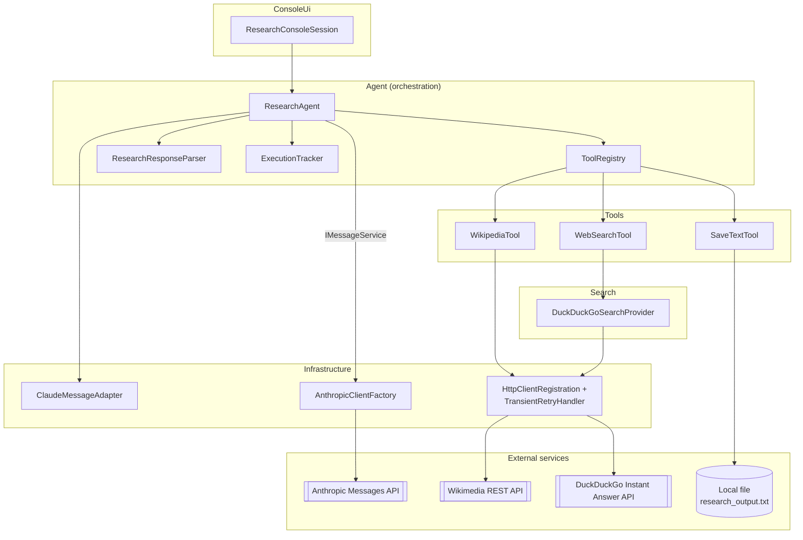
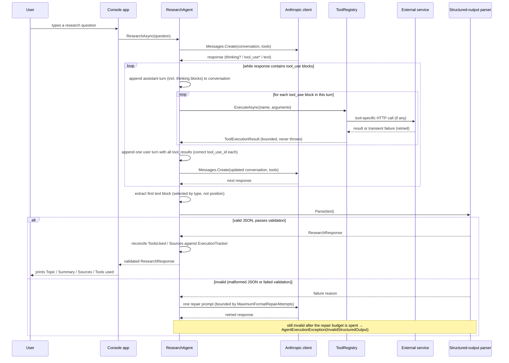
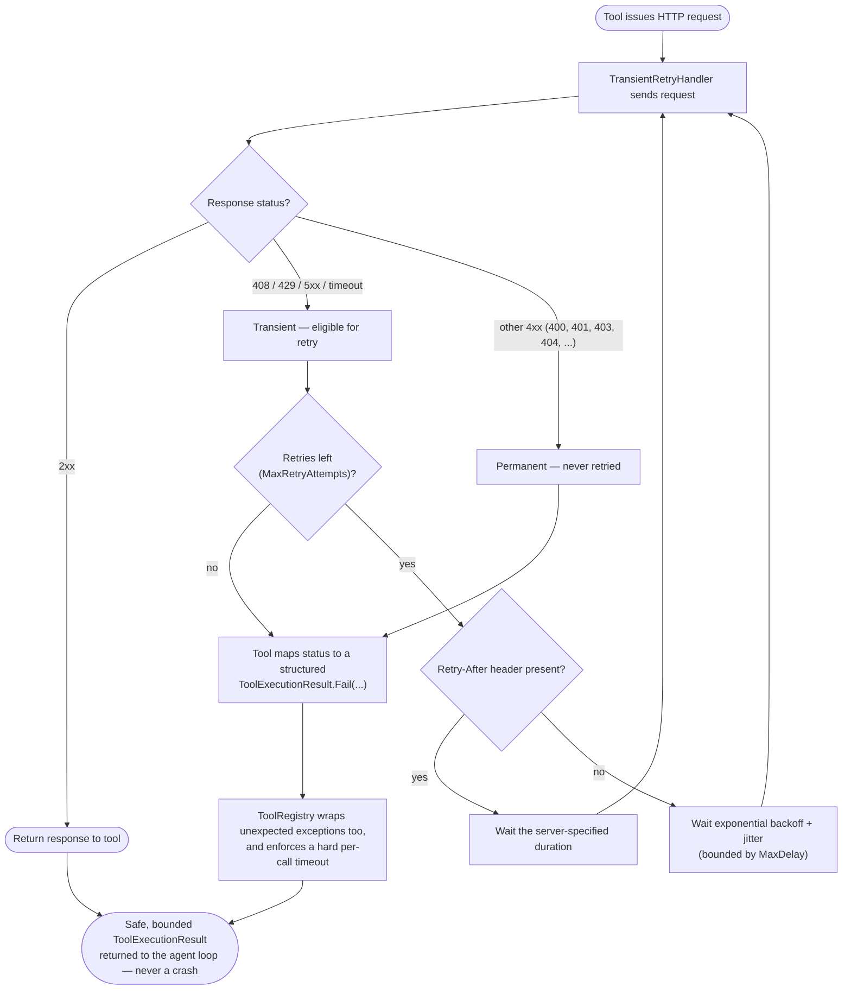

# Claude Research Agent

A .NET 8 console application that answers a research question by letting Claude decide, turn by
turn, whether it needs to call a tool (Wikipedia lookup, web search, or save-to-file) before
producing a final, strongly typed, validated answer.

This is not a demo snippet — it's a full solution: an explicit multi-iteration tool-calling loop
built on the official [`Anthropic`](https://www.nuget.org/packages/Anthropic) C# SDK, resilient
HTTP integrations, a validated structured-output contract, dependency injection, structured
logging, and an xUnit test suite that runs entirely offline (no live API calls, no API key
required).

## Contents

- [Project purpose](#project-purpose)
- [Architecture overview](#architecture-overview)
- [Prerequisites](#prerequisites)
- [Setup](#setup)
- [Anthropic API key configuration](#anthropic-api-key-configuration)
- [Build and run](#build-and-run)
- [Tests](#tests)
- [Project structure](#project-structure)
- [Tools](#tools)
- [The agent loop](#the-agent-loop)
- [Structured output](#structured-output)
- [Configuration reference](#configuration-reference)
- [Secret management](#secret-management)
- [Troubleshooting](#troubleshooting)
- [Known limitations](#known-limitations)
- [Prototype-to-production considerations](#prototype-to-production-considerations)

## Project purpose

Given a research question typed at the console, the agent:

1. Sends the question plus tool schemas to Claude.
2. Lets Claude decide whether it needs external information and, if so, which tool(s) to call —
   across as many reasoning iterations as it needs, up to a configured limit.
3. Executes only explicitly registered tools and feeds the results back to Claude as untrusted
   observations.
4. Once Claude has no more tool calls to make, parses its final answer as JSON, validates it
   against a strict schema, and reconciles it against what the application itself observed
   (which tools actually ran, which sources they actually returned).
5. Prints a clean, structured result — never Claude's internal reasoning.

## Architecture overview

Four concerns are kept in separate layers so the SDK's wire format never leaks past the two
places that are allowed to know about it (`Agent` and `Infrastructure`):



**Layer responsibilities:**

- **ConsoleUi** — the read/run/print REPL loop. No business logic.
- **Agent** — the orchestration layer. `ResearchAgent` runs the explicit tool-calling loop;
  `ToolRegistry` is the single dispatch point for every tool call; `ResearchResponseParser`
  turns Claude's final text into a validated `ResearchResponse`; `ExecutionTracker` is the
  application's own record of what actually happened (see
  [Structured output](#structured-output)).
- **Infrastructure** — the *only* other place, besides `Agent`, allowed to reference Anthropic
  SDK types. `ClaudeMessageAdapter` converts between our domain types and the SDK's message/
  content-block types; `AnthropicClientFactory` registers the SDK client; `HttpClientRegistration`
  wires up named `HttpClient`s with the retry pipeline.
- **Tools** — the three agent-callable capabilities, each implementing `IAgentTool`.
- **Search** — the `IWebSearchProvider` abstraction and its DuckDuckGo-backed implementation, kept
  separate from `WebSearchTool` so the backend can be swapped later.
- **Models** — plain, framework-agnostic domain records (`ResearchResponse`, `ResearchSource`,
  `SearchResult`, `ToolExecutionResult`).

## Prerequisites

- .NET SDK 8.0 or newer (the solution targets `net8.0`; verify with `dotnet --version`)
- An [Anthropic API key](https://console.anthropic.com/settings/keys)
- Internet access at runtime (not required to build or run the test suite)

## Setup

### Command line

```bash
git clone <this-repository>
cd ClaudeResearchAgent
dotnet restore
dotnet build
```

### Visual Studio

1. Open `ClaudeResearchAgent.sln`.
2. Set `src/ClaudeResearchAgent` as the startup project (it already is, being the only
   executable project).
3. Set the `ANTHROPIC_API_KEY` environment variable for the debug session — in the project's
   **Properties → Debug → Environment variables** — rather than editing `launchSettings.json`
   with a real key.
4. Build (Ctrl+Shift+B) and run (F5).

## Anthropic API key configuration

The application reads `ANTHROPIC_API_KEY` **only** from a real process environment variable —
never from `appsettings.json`, source, or a committed file.

```bash
export ANTHROPIC_API_KEY="sk-ant-...your-key..."
```

For local convenience, you may copy `.env.example` to `.env` and fill in the key; `.env` is
git-ignored, and `Configuration/DotEnvLoader.cs` loads it into the process environment at
startup **without overwriting a variable that's already set** — so a real shell/CI environment
variable always wins over the file. This loader is a development convenience only; it is not the
primary mechanism, and nothing in the codebase assumes `.env` exists.

If the key is missing, the app fails fast at startup with a clear message and a non-zero exit
code — it never gets as far as building the DI container or attempting a request.

## Build and run

```bash
dotnet build ClaudeResearchAgent.sln
```

Run from the project directory (so `appsettings.json` and the default
`research_output.txt` resolve as relative paths where you'd expect them):

```bash
cd src/ClaudeResearchAgent
export ANTHROPIC_API_KEY="sk-ant-...your-key..."
dotnet run
```

> Note: `dotnet run --project src/ClaudeResearchAgent` from the repository root does **not**
> change the process's working directory to the project folder — that's standard `dotnet` CLI
> behavior, not specific to this app. Either `cd` into `src/ClaudeResearchAgent` first (as
> above), or run the published/built binary directly from its own output directory.

You'll see:

```
=================================================
 Claude Research Agent
=================================================
Enter a research question, or type 'exit'/'quit' to leave.

Research question>
```

Type a question, watch tool-invocation progress messages stream by, and get a structured answer:

```
Topic:
Hammerhead Sharks

Summary:
...

Sources:
1. Hammerhead shark
   https://en.wikipedia.org/wiki/Hammerhead_shark

Tools used:
wikipedia
```

Type `exit` or `quit` to leave. Ctrl+C cancels the in-flight request gracefully instead of hard-
killing the process.

## Tests

```bash
dotnet test ClaudeResearchAgent.sln
```

All 46 tests run offline — no `ANTHROPIC_API_KEY`, no network access, and no live or paid API
calls are required. Claude's Messages API is replaced with a hand-written fake of the SDK's own
`IMessageService` interface (`FakeMessageService`); HTTP-based tools are tested against a fake
`HttpMessageHandler` wrapped by the real retry pipeline, so retry/backoff behavior is exercised
for real, just not against a real server.

If you do have a key available and want to smoke-test a real call once everything else passes:

```bash
cd src/ClaudeResearchAgent
export ANTHROPIC_API_KEY="sk-ant-...your-key..."
dotnet run
```

(This project does not print, log, or otherwise expose the key at any point.)

## Project structure

```text
ClaudeResearchAgent.sln
├── src/ClaudeResearchAgent/
│   ├── Program.cs                    # Host bootstrap + DI wiring entry point
│   ├── ServiceCollectionExtensions.cs# Composition root
│   ├── appsettings.json
│   ├── Agent/
│   │   ├── IResearchAgent.cs / ResearchAgent.cs   # The explicit tool-calling loop
│   │   ├── AgentOptions.cs           # Bound from the "Agent" config section
│   │   ├── ToolRegistry.cs           # Single dispatch point: timeout + size bounding
│   │   ├── ExecutionTracker.cs       # Authoritative record of tools used / sources retrieved
│   │   ├── IResearchResponseParser.cs / ResearchResponseParser.cs
│   │   └── AgentExecutionException.cs
│   ├── Models/                       # ResearchResponse, ResearchSource, SearchResult, ...
│   ├── Tools/                        # IAgentTool + WikipediaTool, WebSearchTool, SaveTextTool
│   ├── Search/                       # IWebSearchProvider + DuckDuckGoSearchProvider
│   ├── Infrastructure/               # AnthropicClientFactory, ClaudeMessageAdapter,
│   │                                 # HttpClientRegistration, TransientRetryHandler
│   ├── Configuration/                # EnvironmentValidator, DotEnvLoader
│   └── ConsoleUi/                    # ResearchConsoleSession (the REPL loop)
├── tests/ClaudeResearchAgent.Tests/
│   ├── ToolRegistryTests.cs
│   ├── WikipediaToolTests.cs
│   ├── WebSearchToolTests.cs
│   ├── SaveTextToolTests.cs
│   ├── ResearchAgentTests.cs
│   ├── ResearchResponseParsingTests.cs
│   └── TestSupport/                  # FakeMessageService, AnthropicMessageFactory, stubs
├── .env.example
├── Directory.Build.props             # Nullable, warnings-as-errors (main project only), net8.0
└── README.md
```

## Tools

### `wikipedia`

Calls the official MediaWiki REST API (`/w/rest.php/v1/search/page` to find the most relevant
page, `/api/rest_v1/page/summary/{title}` for a concise extract and canonical URL). A descriptive
User-Agent is sent on every request (contact placeholder included, per Wikimedia's API etiquette
policy). Transient failures (timeouts, 429, 5xx) are retried with bounded exponential backoff and
jitter, honoring a `Retry-After` header when present; permanent 4xx responses are never retried.
Every outcome — success or failure — becomes a structured `WikipediaLookupResult` (success flag,
title, URL, summary, error category) so a failure never crashes the agent loop.

### `search`

General web search via the `IWebSearchProvider` abstraction, backed by
`DuckDuckGoSearchProvider`. See [Known limitations](#known-limitations) for why this uses
DuckDuckGo's JSON Instant Answer API rather than scraping the HTML results page. Results are
capped in both count and per-snippet length (`Tools:Search:MaxResults` /
`MaxSnippetCharacters`) before anything reaches the Claude conversation.

### `save_text_to_file`

Appends timestamped content to a single, operator-configured file (`research_output.txt` by
default — see `Tools:SaveText:OutputFilePath`). Claude supplies content only; there is no `path`
argument in the tool's schema, and the implementation never reads one even if a prompt injection
attempt tried to smuggle one into the arguments. Concurrent calls are serialized with a semaphore;
content over `Agent:MaximumSaveCharacters` is rejected outright.

## The agent loop



Key points, matched directly to the implementation:

- **Blocks are selected by type, not position** (`ClaudeMessageAdapter.ExtractFinalText` /
  `ExtractToolUseBlocks` scan every block in `response.Content` and use the SDK's `TryPickText` /
  `TryPickToolUse` / `TryPickThinking` / `TryPickRedactedThinking` discriminators). A response
  that leads with a thinking block, or has text somewhere other than first, is handled correctly
  — see `ResearchAgentTests.Finds_the_text_block_even_when_a_thinking_block_comes_first`.
- **The full assistant turn — including thinking/redacted_thinking blocks — is echoed back
  unmodified** the next time a tool_use is being answered, because the Claude API requires it
  (`ClaudeMessageAdapter.BuildAssistantMessage`). Thinking content is preserved in the wire
  conversation but is never written to console output or application logs.
- **Multiple tool_use blocks in a single turn are all executed**, and each `tool_result` carries
  the exact `tool_use_id` it answers (`ResearchAgentTests.
  Executes_multiple_tool_requests_from_a_single_assistant_turn_with_correct_ids`).
- **`ToolRegistry` is the single point that can't be bypassed**: an unknown tool name gets a safe
  `unknown_tool` failure instead of a crash; every call is bounded by `Agent:ToolTimeoutSeconds`;
  every observation is truncated to `Agent:MaximumToolResultCharacters` before it re-enters the
  conversation.
- **The loop is always bounded**: by `Agent:MaxIterations`, by `Agent:OverallTimeoutSeconds`
  (a linked `CancellationTokenSource`), and by `Agent:MaximumFormatRepairAttempts` for the
  structured-output repair path. Every bounded failure surfaces as a typed
  `AgentExecutionException` with an `AgentFailureReason` — never an unhandled exception, and
  never a silent infinite loop.

### Tool failure and retry behavior

`TransientRetryHandler` (built on `Microsoft.Extensions.Http.Resilience` / Polly — .NET's
recommended resilience library) sits in front of both the Wikipedia and DuckDuckGo `HttpClient`s:



`WikipediaTool`'s own status-code handling is a further, deliberate exception to that flow: a
`404` from the search endpoint means "no page found," which is treated as a normal empty-result
outcome (`not_found`), not an error — it's checked before `EnsureSuccessStatusCode()` even runs,
so it's never retried and never wrapped as a network failure.

## Structured output

Claude is not trusted to produce valid JSON just because the system prompt asks for it. The full
contract is enforced in code:

1. **Explicit JSON contract in the system prompt** (`ResearchAgent.SystemPrompt`) describing the
   exact shape: `topic`, `summary`, `sources[]` (`title`, `url`, `excerpt`), `toolsUsed[]`.
2. **Deserialize with `System.Text.Json`** (`ResearchResponseParser.Parse`). A leading/trailing
   ```` ```json ```` fence is stripped defensively (models add one even when told not to), but
   that's a convenience, not a trust boundary.
3. **Validate** (`ResearchResponseValidation.Validate`): `Topic`/`Summary` non-empty, every source
   has a non-empty title and an absolute `http`/`https` URL. Because `ResearchResponse`'s
   properties are C# `required` members, `System.Text.Json` itself rejects JSON missing a
   required field before validation even runs.
4. **At most one targeted repair attempt**, bounded by `Agent:MaximumFormatRepairAttempts`
   (default `1`). On failure, the agent sends Claude a follow-up message containing the specific
   parse/validation error and asks it to try again — once. There is no unbounded repair loop; see
   `ResearchAgentTests.Performs_at_most_the_configured_number_of_repair_attempts`.
5. **The original parsing exception is preserved as diagnostic context** via structured logging
   (`ResearchResponseParser` logs the `JsonException` at `Warning` before returning a failure
   reason) — it is not swallowed.
6. **Application state is authoritative, not the model's claims.** `ExecutionTracker` records
   which tools *actually* executed successfully and which sources a tool call *actually*
   returned. After a structurally valid response is parsed:
   - `ToolsUsed` is **replaced outright** with the tracker's own record — a tool Claude merely
     *claims* it used, but never actually invoked, cannot appear in the final answer.
   - `Sources` is **filtered** to only entries whose URL a tool call genuinely returned; an
     invented URL is silently dropped rather than trusted.

   See `ResearchAgentTests.Strips_invented_sources_and_uses_recorded_tool_names_as_authoritative`.

No provider-native structured-output mode was substituted for this flow: the SDK version in use
(`Anthropic` 12.40.0) does not expose a documented structured-output feature that composes with
the multi-turn tool-calling loop this agent requires, so the prompt-contract-plus-validation
approach above is the one actually implemented — not merely a fallback described in the abstract.

## Configuration reference

`appsettings.json`:

```json
{
  "Agent": {
    "Model": "claude-sonnet-5",
    "MaxIterations": 8,
    "OverallTimeoutSeconds": 120,
    "ToolTimeoutSeconds": 30,
    "MaximumToolResultCharacters": 12000,
    "MaximumSaveCharacters": 50000,
    "MaximumFormatRepairAttempts": 1,
    "MaxTokens": 4096
  },
  "Tools": {
    "Wikipedia": { "UserAgent": "...", "RequestTimeoutSeconds": 10, "MaxRetryAttempts": 3 },
    "Search": { "MaxResults": 5, "MaxSnippetCharacters": 400, "RequestTimeoutSeconds": 10, "MaxRetryAttempts": 3 },
    "SaveText": { "OutputFilePath": "research_output.txt" }
  }
}
```

| Setting | Purpose |
|---|---|
| `Agent:Model` | Claude model ID, e.g. `claude-sonnet-5` |
| `Agent:MaxIterations` | Hard cap on Claude round-trips per question |
| `Agent:OverallTimeoutSeconds` | Wall-clock budget for the whole research run |
| `Agent:ToolTimeoutSeconds` | Per tool_use call timeout, enforced by `ToolRegistry` |
| `Agent:MaximumToolResultCharacters` | Every tool observation is truncated to this before re-entering the conversation |
| `Agent:MaximumSaveCharacters` | Max content length `save_text_to_file` accepts |
| `Agent:MaximumFormatRepairAttempts` | Max structured-output repair round-trips |
| `Tools:Wikipedia:UserAgent` | Sent on every Wikimedia API request |
| `Tools:Search:MaxResults` / `MaxSnippetCharacters` | Bounds on web content entering the conversation |
| `Tools:SaveText:OutputFilePath` | The one path `save_text_to_file` ever writes to |

Override any of these with environment variables using the standard ASP.NET Core configuration
convention, e.g. `Agent__MaxIterations=4`.

## Secret management

- `ANTHROPIC_API_KEY` is read from a real environment variable only — never from
  `appsettings.json`, source, test fixtures, or this README.
- `.env` is git-ignored; `.env.example` documents the variable name with an empty value.
- The console never prints the key, raw authorization headers, or other sensitive SDK
  diagnostics.
- `research_output.txt` (the default save-tool output) is git-ignored, since it may contain
  content pulled from live research sessions.

## Troubleshooting

| Symptom | Likely cause | Fix |
|---|---|---|
| `Environment variable ANTHROPIC_API_KEY is not set` at startup | Key not exported in this shell/session | `export ANTHROPIC_API_KEY=...` (or set it in `.env`) |
| `appsettings.json`-driven config looks like defaults were ignored | Running from the wrong working directory | `cd src/ClaudeResearchAgent` before `dotnet run`, or run the built binary from its own output folder |
| `AgentExecutionException` with `Reason = ModelUnavailable` | Configured `Agent:Model` doesn't exist / isn't available to your key | Check the model ID against your account's available models |
| `AgentExecutionException` with `Reason = MissingApiKey` mid-run | Anthropic API returned 401 despite the env var being set | The key is invalid/revoked — check the console at console.anthropic.com |
| `AgentExecutionException` with `Reason = MaxIterationsExceeded` | The question needed more tool round-trips than `Agent:MaxIterations` allows | Raise `Agent:MaxIterations`, or simplify the question |
| Web search returns few/no results | DuckDuckGo's Instant Answer API has narrow coverage | See [Known limitations](#known-limitations) below |
| `dotnet test` fails to restore | No internet access for NuGet restore | Run `dotnet restore` once with connectivity before working offline |

## Known limitations

- **`search` tool coverage.** `DuckDuckGoSearchProvider` uses DuckDuckGo's documented JSON
  "Instant Answer" API (`api.duckduckgo.com/?format=json`), not a general ranked web-search index.
  It reliably returns results for topics with a Wikipedia-style abstract or a disambiguation/
  related-topics list, but frequently returns few or zero results for narrow, current-events, or
  long-tail queries. This was a deliberate choice over scraping DuckDuckGo's HTML results page,
  which has no stability contract and can change layout without notice. If broader coverage is
  needed, swap in a paid search API (Bing, Brave Search, Tavily, ...) behind the same
  `IWebSearchProvider` interface — `WebSearchTool` and the agent-facing tool name (`search`) don't
  need to change.
- **English Wikipedia only.** `WikipediaTool` targets `en.wikipedia.org`; it does not attempt
  language negotiation.
- **No persistent conversation memory.** Each research question starts a fresh conversation; the
  agent does not remember earlier questions in the same console session.
- **Single-process file writes.** `SaveTextTool`'s concurrency guard is an in-process semaphore,
  not a cross-process file lock — safe for this console app's own concurrent tool calls, not for
  multiple separate processes writing to the same configured path simultaneously.

## Prototype-to-production considerations

This solution is production-conscious (typed config, bounded execution, resilient HTTP,
structured logging, no secrets in source, a real test suite) but a few things would need
attention before a real deployment:

- **Search provider.** Replace or supplement `DuckDuckGoSearchProvider` with a paid, higher-
  coverage search API for production-quality answers (see [Known limitations](#known-limitations)).
- **Observability.** Wire the existing `ILogger` structured logs into a real sink (e.g.
  OpenTelemetry/Application Insights) rather than the console formatter used here.
- **Multi-user hosting.** This is a single-user console app; a hosted version would need
  per-request/per-user conversation isolation, rate limiting, and authentication in front of the
  Anthropic key rather than a single process-wide client.
- **Content moderation.** The system prompt asks Claude to flag insufficient evidence and never
  fabricate sources, but a production system handling untrusted end-user questions should add its
  own input/output moderation layer independent of model behavior.
- **`save_text_to_file` storage.** For a hosted/multi-user deployment, replace the single local
  file with per-user, access-controlled storage (blob storage, a database row, ...) — the fixed-
  path design here is intentionally simple for a single-user console tool.
